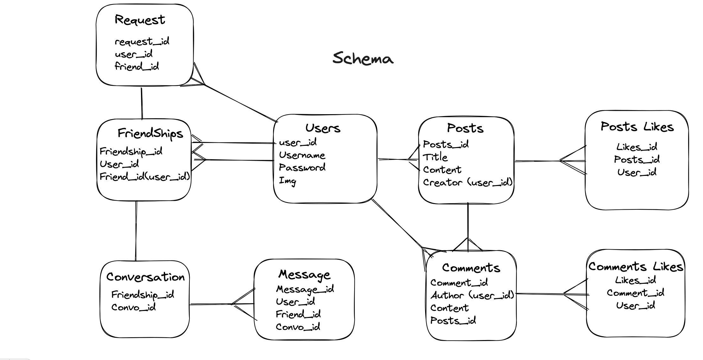
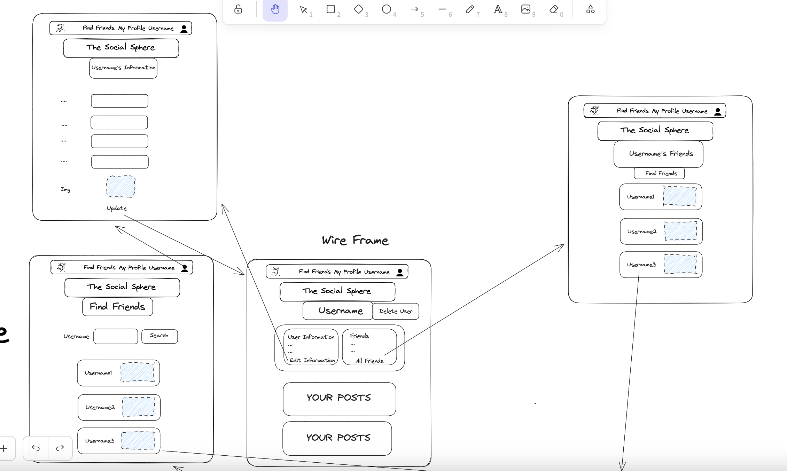
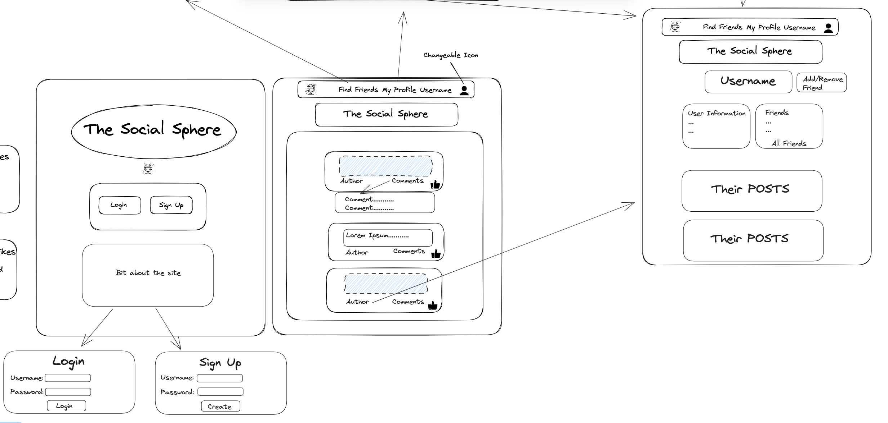
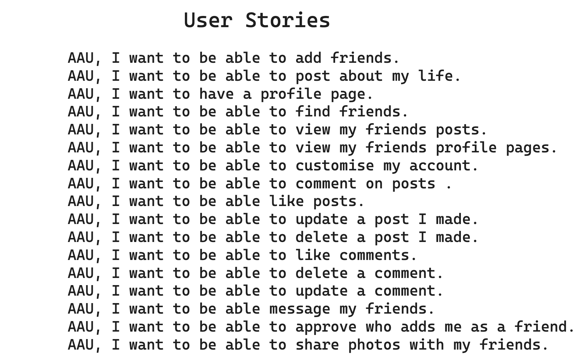

# The Social Sphere

## Description

This project was the final project of the General Assembly Software Engineering Immersive course and the aim of the project was to create a full stack application using either: MERN stack, full Ruby stack or React front end with Rails back end. Outside of that we were given the freedom to design what we wanted. I decided to design a social media app as they are very prevalent in today’s society and it has some complex features which I wanted to try to create.

## Deployment

[Deployment Link](https://thesocialsphere.netlify.app/)

## Timeframe & Working Team

This was a solo project done over 8 days. 

## Technologies Used

### Front End

* React
* React Router
* SASS
* JSX
* JavaScript

### Back End

* Ruby on Rails
* Devise
* Devise-JWT
* Ruby

### Database

* PostgreSQL

### Code Version Control

* Git
* Github

### Design

* Excalidraw

## Brief

Build a full stack application. Must be your own work.
Select a Project idea of your own
Have at least 2 models (more if it makes sense).
Auth is a requirement
Have full crud on at least one of your models.
Be able to Add/Delete on any remaining models.
Have high quality code:
* Follow accepted naming conventions
* Consistent indentation
* Well-structured and readable code
* Semantic naming of variables, functions, CSS classes, etc.
* Short and clear functions that do one thing
* Efficient code - if you have your MVP, refactor
DRY (Don’t Repeat Yourself) code
Use one of these technology stacks. You may choose which tech stack.
* Full-Stack Rails App
* Rails API with React Front-End
* Express API with React Front-End
Be deployed on Heroku or similar platform
Craft a README.md file that explains your app.

## Planning

Before I started any of the code, I made sure I planned out the project effectively. I spent the first day of the project planning it out in Excalidraw. It also helps me when I know what I am building towards.

### ERD’s

I mapped out what models I would need and how they would be connected together through foreign key. This was very helpful as it helped me understand how data would flow through my project and how I would need to layout my models in the backend.


### Wireframe

I drafted up a wireframe so I would have a general idea of what my app would look like. It was also helpful as it helped me understand what information I would need from the backend on each page. Also it allowed me to decide what basic features I would be striving towards and how the app would flow from page to page.
 

### User Stories

I decided to build on the basic features and create some user stories so I could figure how I could cater my app best to the user to maximise their experience. 



I later realised my initial plan was too big and I would need to scale down a bit to meet the time constraints but would keep the other plans as future improvements.

## Build/Code Process

Tackling the friending feature was probably the main hurdle for me in developing this app. I wanted requests to be sent before two users became friends. I created a friend request model which had a column called status which would deal with the different states of the request: pending, accepted and rejected. It starts off as pending when the request is sent which just means the request is in stasis and nothing will really happen and is waiting for its status to be changed. I then created a method within the model for what happens when the status changes to accept or reject.

When the request is accepted it creates an instance of the friendship model with the sender of the request and receiver of the request as the two users. It then destroys the friend request, I decided to destroy it afterwards for two reasons; first reason was to prevent having a lot of unnecessary information in the database and the second was if the two users unfriend but then try to become friends again the validation was blocking it as there was already an instance of the friend request still in the system. If the request is rejected it simply destroys the request.

```ruby
enum status: { pending: 0, accepted: 1, rejected: 2 }

def accept
  Friendship.transaction do
  Friendship.create(user: sender, friend: receiver)
  update(status: :accepted)
  destroy
end
def reject
  update(status: :rejected)
  destroy
end
```

When the friendship is created from a user accepting a request, I want the inverse friendship to be created. I did this by using after_create to call the method I created called create_inverse_friendship. This method will create the friendship with the user_id and the friend_id the other way round so that the friendship goes both ways. I created a similar method for destroying friendships where it will find and destroy the inverse at the same time as it destroys a friendship. 

```ruby
belongs_to :user
belongs_to :friend, class_name: 'User', foreign_key: 'friend_id'

after_create :create_inverse_friendship

def create_inverse_friendship
existing_inverse_friendship = friend.friendships.find_by(friend: user)
return if existing_inverse_friendship.present?
friend.friendships.create(user: friend, friend: user)
end
```

For the like model I originally wanted to use two models one for comments and one for posts. However, I discovered something called polymorphic association in rails which allowed me to achieve what I wanted and only use one model. Effectively what it does is allow you to have a dynamic foreign key link in the likes model. All I have to do is pass the name of the model I want to link with the likes model as well as the relevant Id, of the post or comment I was linking that specific like to, and it would work. It was also very simple to set up. All I needed to do was create a foreign key, the name could be anything I chose likeable as it was relevant to what I wanted it to achieve, and have polymorphic as true.

	```ruby
class Like < ApplicationRecord
belongs_to :user
belongs_to :likeable, polymorphic: true
end
	```

Afterwards I needed to go to the models I wanted to be able to have this connection and state that it has_many likes, as likeable (or whatever I chose the name to be). It was surprisingly simple and made my code a lot more efficient.

```ruby
class Post < ApplicationRecord
  has_many :likes, as: :likeable, dependent: :destroy
end
```

For the homepage feed I wanted the user to get all of their friends and their own posts. First I grabbed all the user’s friends Id’s and stored them in a variable I used pluck so I was only grabbing the Id and no other unnecessary information. Then I looked for all posts where the user_id on the post was either the current user’s Id or the friend’s Id and flattened them so they were all at the same level of nesting.

```ruby
def get_all_posts
  @friend_ids = @user.friends.pluck(:id)

  @user_and_friends_posts = Post.where(user_id: [@friend_ids, @user.id].flatten).order(updated_at: :desc)
end
```

I wanted the edit feature to be inline and not take the users away from what they were doing. I wanted when you click on the edit button for the text to change to an input box seamlessly for the user to edit.
To achieve this first I set up a state with a boolean value set by default to false. When the state is set to false the post/comment cannot be edited but when it is set to true it can be edited.

```js
const [ updateForm, setUpdateForm ] = useState(false)
```

Simple inline function on the update button that flips the state's boolean value.

```js
<button
onClick={() => setUpdateForm(!updateForm)}
>
```

I used a ternary when displaying the information; if the state is set to true it would show the post form component which would have the information about the post (in this case) so it would display the current information of the post within the input box to begin with.
If the state was false it would simply display the information from the post on the page. I am happy with how it turned out and feel I accomplished what I wanted to in regards to the update button.

```js
{updateForm ?
<PostForm
setUpdateForm={setUpdateForm}
post={post}
setList={setList}
userPostsList={userPostsList}
index={index}
/>
:
<div className='post-content'>
<h3>{post.content}</h3>
<p>Author: {post.author}</p>
<p>Liked by:
{postLike.liked_by.map((info, index) => {
return index === 0 ? ` ${info}`: `, ${info}`
})}
</p>
</div>}
```

## Challenges

* One of the biggest challenges I faced while developing the app was coming up with a friending system. Early on I realised this would be an issue so I spent some time researching ways to implement the feature. I made sure I evaluated many different ways to do it before settling on one as I wanted to make sure I was happy with the option I had. I found it difficult as the friendship had to have two foreign keys linking back to the same model (user model) and I needed to create two friendships per pair as both were friends with each other not just one way. I eventually was able to overcome the problem through reading articles and consulting with my tutors on the course.

* When implementing the liking feature at first I could only think of having two separate models one for comments liked and one for posts liked (as can be seen in  the ERD’s plan). This didn’t seem like a very efficient way of solving the method. After some research I came across polymorphic associations, this was the perfect solution to my problem. In polymorphic association a model can have a foreign key that relates to a set of different models however when you create an instance of the model you pass it which of the set of models you want this instance to relate to. This allowed me to have one like model that works for both comments and posts. I also had trouble with the unliking feature as I wanted the username of whoever liked the post/comment to appear which created extra problems. This meant I would need the like_id that I wanted to remove to be passed in the API call. However unless I attached an unlike button to every displayed person's name it would not be easy to acquire the like_id. This feature is still a work in progress.

## Wins

* I am very happy with how the friending feature worked out in the end. I was able to implement a friend request system on top of the simple friending system I had in mind. This was probably the feature I spent the most time researching so it gives me a lot of satisfaction that it works better than originally anticipated.

* Similar to the point above, the liking feature I got to work is more efficient than the plan I originally made as it is one model instead of two. Unfortunately, I wasn’t able to get the unliking feature to work within the time constraints but that was mainly due to me choosing to display who liked the comment/post rather than just a number.

* My original plan for the search feature was to use the like feature in SQL however, I was not very happy as it would only return users who contained exactly that combination not similar ones. This didn’t allow for typos or simply returning more answers that were similar. I discovered this gem called fuzzy match which searches using the  Levenshtein distance. This checks how similar two words are and counts how many characters are different if it is within a chosen catchment it is returned if not it is omitted. This worked perfectly and accounts for typos improving user experience.

* Another win was it was my first time using a language other than JavaScript in my projects. The rails backend works as intended and despite some initial hiccups was not as hard as I had anticipated.

## Key Learnings/Takeaways

* A major takeaway I got from this project is that it is not necessary to reinvent the wheel. What I mean by that is that instead of trying to create something from scratch it may be worth investigating whether there are any gems (or whatever the relevant language uses) that accomplish the task. Someone obviously encountered a similar issue and came up with a solution to the task so instead of starting from the beginning it could be worth investigating their method. There might not be a relevant gem or it may not be fit for purpose but it is worth checking in case there is as programming is all about collaboration and they created those gems to help others who encounter a similar issue that they did.

## Bugs

* I am not currently aware of any bugs on the app.

## Future Improvements

* I want to add a messaging feature to the app so that users can chat with their friends privately or in a group.

* I want to allow users to be able to upload image posts rather than just text posts.

* I want users to be able to have a customisable profile picture that allows them to upload their own image to it.

* I want when you unfriend someone for it to instantly remove them from the sample of friends on the profile page.

* I want to allow users to unlike posts or comments.
